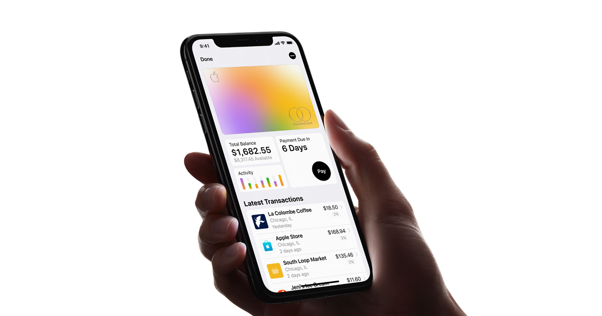

<!--
  ~ Licensed to the Apache Software Foundation (ASF) under one or more
  ~ contributor license agreements.  See the NOTICE file distributed with
  ~ this work for additional information regarding copyright ownership.
  ~ The ASF licenses this file to You under the Apache License, Version 2.0
  ~ (the "License"); you may not use this file except in compliance with
  ~ the License.  You may obtain a copy of the License at
  ~
  ~      http://www.apache.org/licenses/LICENSE-2.0
  ~
  ~ Unless required by applicable law or agreed to in writing, software
  ~ distributed under the License is distributed on an "AS IS" BASIS,
  ~ WITHOUT WARRANTIES OR CONDITIONS OF ANY KIND, either express or implied.
  ~ See the License for the specific language governing permissions and
  ~ limitations under the License.
  -->

# A new kind of credit card. Created by Apple, not a bank.

[Apply](marquise.helix-demo.xyz)

---

Apple Card completely rethinks everything about the credit card.

It represents all the things Apple stands for. Like simplicity, transparency, and privacy.

It builds on the incredible ease and security that millions of people love about Apple Pay.

And it’s the first card that actually encourages you to pay less interest.

Whether you buy things with Apple Pay or with the laser‑etched titanium card, Apple Card can do things no other credit card can do.

---

## The power of iPhone. In a credit card.

Apple Card lives on your iPhone, in the Wallet app. And that makes all kinds of new things possible.

You can sign up in no time and start using it right away with Apple Pay.1 For every purchase you make, you get Daily Cash. And it really is cash. So you can spend it however you want, right from your iPhone. Have a question? Just text. It’s that simple.

---

## You'll know so much more about your spending. At a glance.

See a charge you don’t recognize? Tap to pinpoint it on a map.2

---

Everything you buy gets a category and a color.
  * ### Entertainment 
  * ### Food & Drinks
  * ### Shopping

---